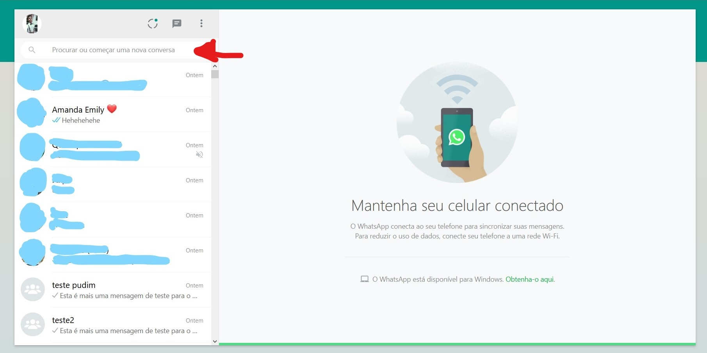
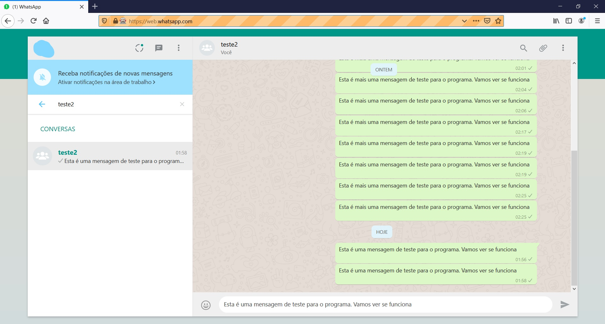
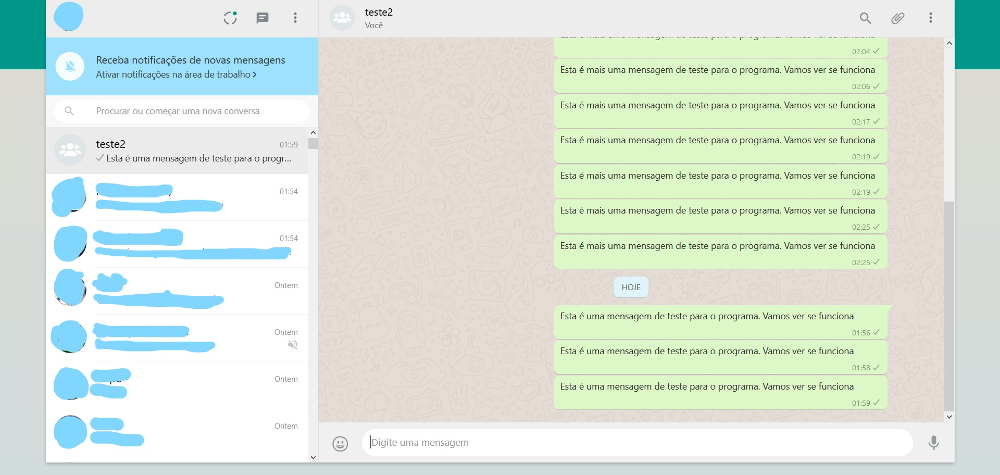
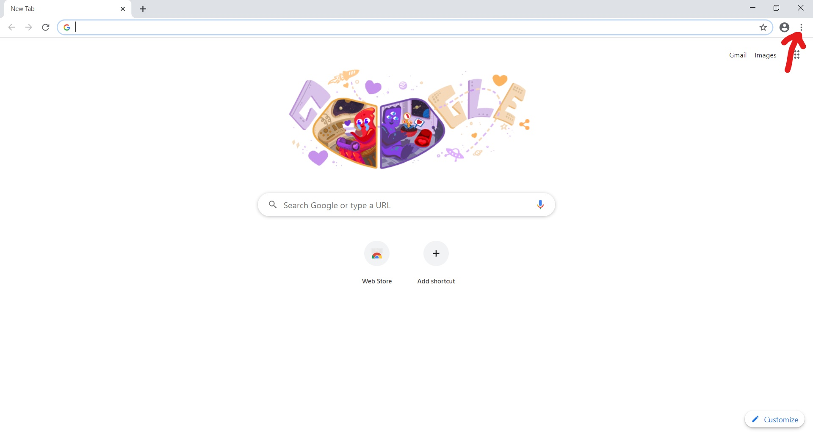
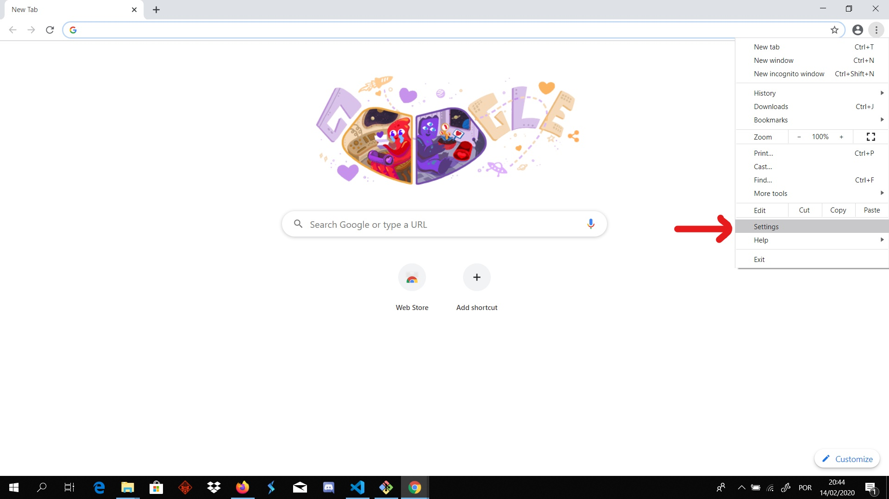
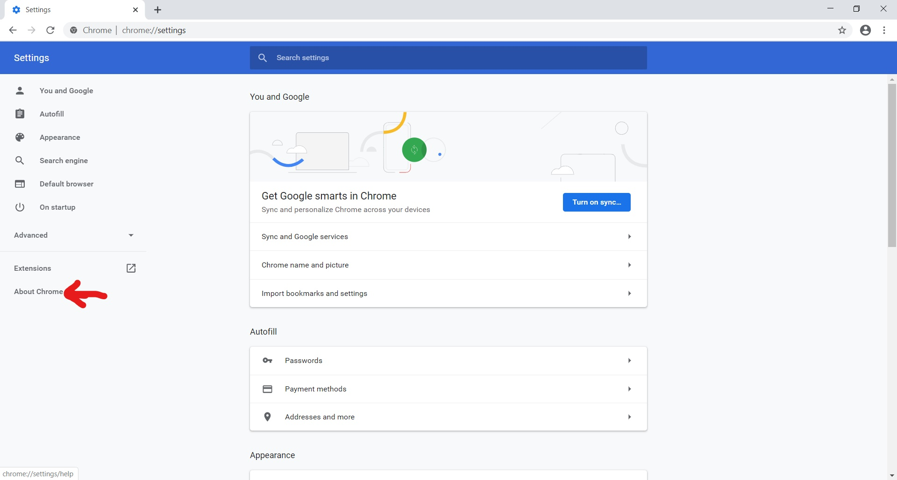
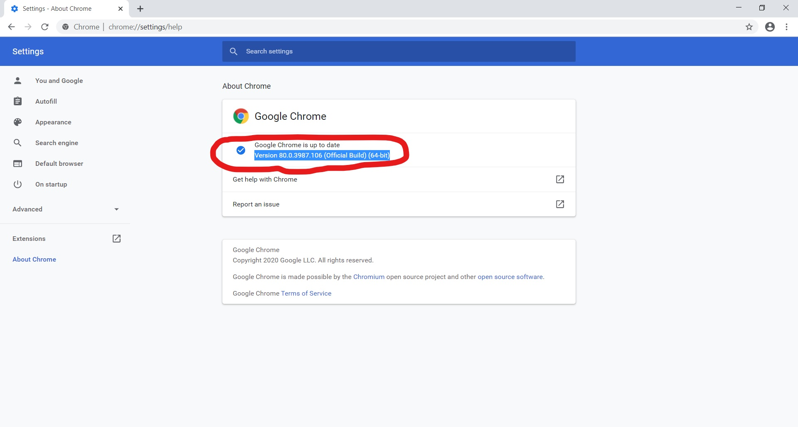
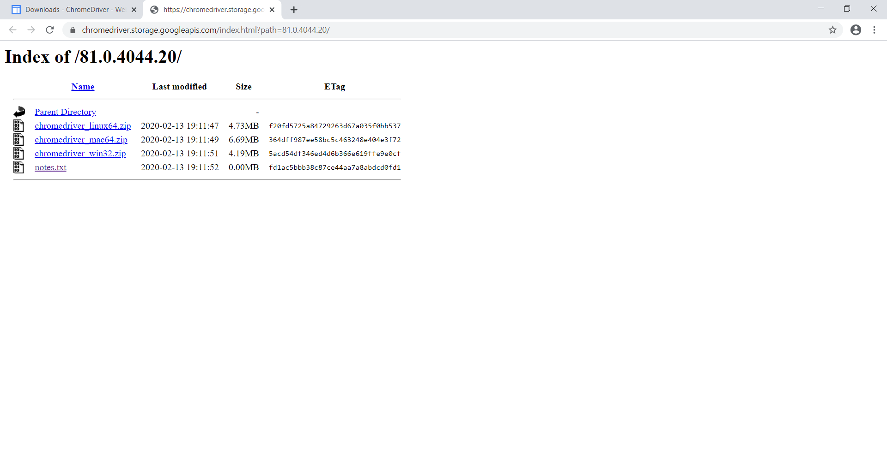

# WhatsApp Bot
This is, basically, a very simple bot made to send messages automatically to a list of contacts via WhatsApp Web.</p>
The list of contacts is read from a `.vcf` file.</p>
This project was built using:
* python 3.6
* Selenium</p>
Running the bot it's just as simples as using one of the following commands:
* `py.exe bot.py`
* `py bot.py`
* `python bot.py`
* `python3.6 bot.py`

After running the code, you'll see this screen:

Since the moment the code starts running, the program will wait for 15 seconds before star executing comands. So, if it is taking you longer then that to log in WhatsApp Web, try increasing the waiting time.</p>
When you're in, the bot will start tipping the names where the red arrow is pointing at:</p>


And then types the message and sends it:</p>


And then it repeats the process untill the end of the contact list.</p>
When it gets to the end, the bot logs out of the WhatsApp Web session.
# Set Things Up Before Get To Work
In order to use this bot, you'll have to install `selenium` and set the webdrivers up.</p>
## Installing Selenium
Use one of the following commands:
* `pip install selenium`
* `python -m pip install selenium`

## Setting WebDrivers Up
### Mozilla Firefox
If you're using Mozilla Firefox, you'll have to download `geckdriver`. So, click on one of the options bellow and it'll redirect you to the download.</p>
[`geckodriver-v0.26.0-win32.zip`](https://github.com/mozilla/geckodriver/releases/download/v0.26.0/geckodriver-v0.26.0-win32.zip)</p>
[`geckodriver-v0.26.0-win64.zip`](geckodriver-v0.26.0-win64.zip)</p>
After downloading the file, extract it.</p>
Now, on the command line, type: `mv geckodriver.exe /usr/local/bin`, and in case that one doesn't work, try `mv geckodriver.exe /usr/bin`.</p>
Now you're all set.
### Google Chrome
The first thing that you'll have to do is check your Google Chrome version.</p>
To do so, follow these steps:</p>




"Is this important?". Yes sir, it is. Thing can get really messed up later if you don't have a webdriver's version that corresponds to your browser's version.</p>
Next step is going to this website [`https://chromedriver.chromium.org/downloads`](https://chromedriver.chromium.org/downloads) (Go ahead! Click it!) and look for the WebDriver's version you should download. In my case, it'll be the [` ChromeDriver 81.0.4044.20`](https://chromedriver.storage.googleapis.com/index.html?path=81.0.4044.20/).</p>
And now download the zip file:</p>

Now, the steps are pretty much the same we followed to config geckodriver.</p>
* Extract the file;
* Use the command: `mv chromedriver.exe /usr/local/bin` or `mv chromedriver.exe /usr/bin`.
# How Does It Work?
The program opens the contact file, which in this case is named as `contacts.vcf`, and appends all its lines to a temporary list - `temp_list`.</p>
Once the contacts file is a *vcf* file, its content format is something like this:
```
BEGIN:VCARD
VERSION:2.1
N;CHARSET=UTF-8;ENCODING=QUOTED-PRINTABLE:=45=6D=69=6C=79=20=E2=9D=A4=EF=B8=8F;=41=6D=61=6E=64=61;;;
FN;CHARSET=UTF-8;ENCODING=QUOTED-PRINTABLE:=41=6D=61=6E=64=61=20=45=6D=69=6C=79=20=E2=9D=A4=EF=B8=8F
TEL;CELL:+111
TEL;CELL:+111
TEL;HOME:+111
END:VCARD
BEGIN:VCARD
VERSION:2.1
N:(NOS);Marinete;;;
FN:Marinete (NOS)
TEL;CELL:+111
TEL;CELL:+111
TEL;HOME:+111
END:VCARD
```
Notice that the informations we're looking for, the names, succeed the elements `FN:` or `FN;`. And yes. That ' : ' / ' ; ' makes a great difference here.</p>
`FN;` is followed by names with characters that are not in the ASCII table, so they'll have to be decoded later.</p>
`FN:`, on the other hand, is followed by names with characters that are in the ASCII table.</p>
Regardless the way that the names are encoded at, they are all treated the same way, at first. The `find()` is used to look after the `temp_list` element that contains `FN:` or `FN;`.</p> 
If a `FN:` is found, the program will simply append it (with its follwed by information - the name) to the `name_list`, but without the `FN:`.</p>
To make it even easier to see, here's an simple example:</p>
Consedering the following example as the contact file content.
```
BEGIN:VCARD
VERSION:2.1
N:Diniz;Arthur;;;
FN:Arthur Diniz
TEL;CELL:+111
TEL;CELL:111
TEL;HOME:111
X-GROUP-MEMBERSHIP:My Contacts
X-GROUP-MEMBERSHIP:My Contacts
```
All lines will be appended to the `temp_list` and then, only the line with `FN:` will be appended to the final `name_list`, removing, of course, the `FN:` from it.</p>
Even though, when it comes to `FN;`, the program have to deal with the info in a really different way.</p>
The first reason to that it's the way the information is presented:</p>
`=41=6D=61=6E=64=61=20=45=6D=69=6C=79=20=E2=9D=A4=EF=B8=8F`</p>
And the second reason is the way the `.vcf` file deals with long lines. Instead of having all the encoded information in one line. We have this:</p>
`=50=54=2D=43=6F=6E=74=61=64=6F=72=61=20=46=65=72=6E=61=6E=64=61=20=49=`</p>
`=6E=74=65=72=6D=61=63=68=C3=A9`.</p>
In order to act accordly to these two ways of providing information, there's a `if` statement to look after a `"="` at the end of the first line. If that checks out, the program will add to the `encoded_list` two lines: the one with the `FN:`, that will end in `"="`, and the next line too, that starts with `"="`.</p>
So, the `encoded_list` will be like this:</p>
```
['FN;CHARSET=UTF-8;ENCODING=QUOTED-PRINTABLE:=50=54=2D=43=6F=6E=74=61=64=6F=72=61=20=46=65=72=6E=61=6E=64=61=20=49=', '=6E=74=65=72=6D=61=63=68=C3=A9']
```
Although, this list still has some unnecessary information, such as:</p>
`FN;CHARSET=UTF-8;ENCODING=QUOTED-PRINTABLE:` and the `"="` signal at the beggining of the last element of the list.</p>
So, the program removes the `"="` and joins the two elements of the list on a string, removing this part:</p>
`FN;CHARSET=UTF-8;ENCODING=QUOTED-PRINTABLE:`</p>
And then, that'll be a nice long string, called `encoded_name`, with the whole information essential information for decoding. And that's what the program does next and appends that decoding string to a list:</p>
```
quopri.decodestring(encoded_name)).decode('utf-8')
```
And another little problem that make come up is: emojis.</p>
If one of the names in the contact file has a emoji in it, the most likely is that the bot will fail. But i cannot tell for sure cause i haven't many tests with this, but as least the "red heart" emoji was covered.</p>
The last possible scenario for names in the contact file is this:
```
END:VCARD
BEGIN:VCARD
VERSION:2.1
N:;teste2;;;
FN_GROUP:teste2
END:VCARD
```
There is no `FN:` or `FN;`, but there is a `FN_GROUP:`. That tag is for group names, as you might probably tell right?. And it'll work pretty much like the other tags we've seen before.</p>
# Conclusion
This bot still needs plenty of testing and improvement, and I am oppened to some constructive criticism for sure, and willing to make some modifications to the code based you the community suggestions.</p>

This rep has a file named as `contacts.vcf` with an example of the format that the contacts/groups will follow.
One little note here: this bot was built to work on Mozilla Firefox (`bot.py` file) and Google Chrome (`bot_chrome.py`), so it'll definitely not work on different browsers, etc. At least for now.</p>


## Bugs
Still didn't figure out how to fix it, but when the bot looks for a name and it is so large that it won't even been shown entirely, the program fails in fiding the element.</p>
I might fix this bug in the next few days. For now, avoid large names.
